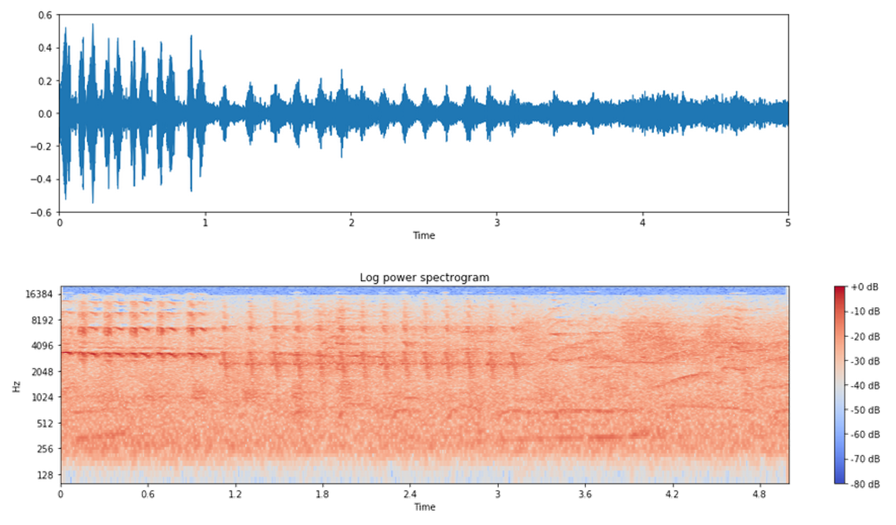
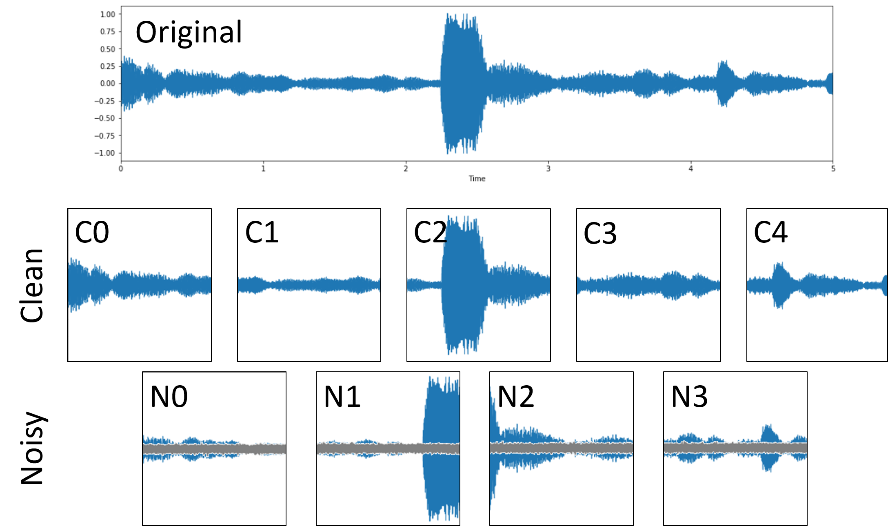
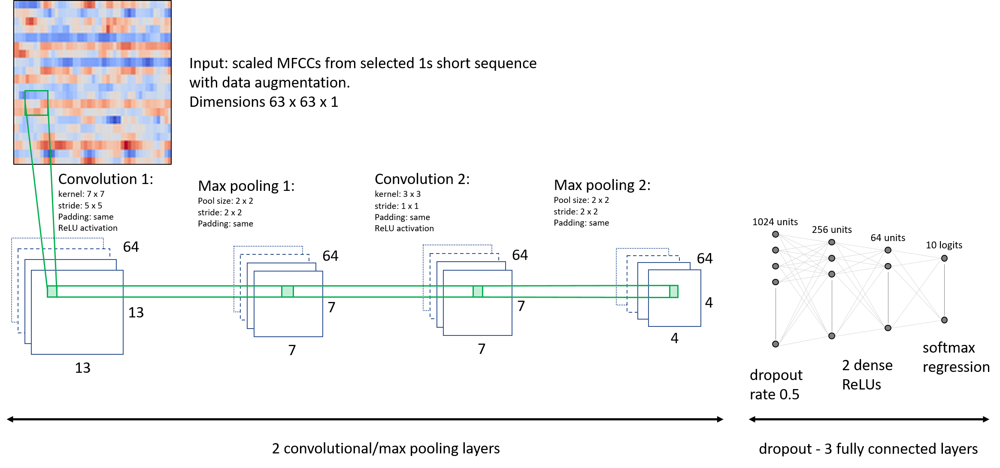
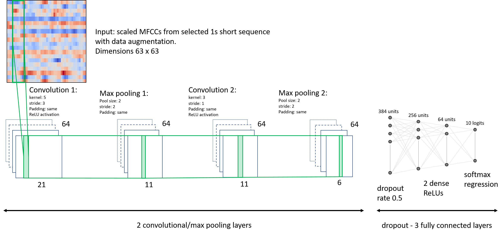

# Sound Event Classification with data augmentation and CNN

## _Christophe Lesimple_

## 1. Problem Definition

This repository will focus on the influence of the audio feature selection on the accuracy of acoustical event classification.  The amount of data generated by an audio signal can easily reach large sizes.  Additionally, a lot of information (e.g., harmonics and timbre) is not apparent in the waveform of a signal. Consequently, the raw waveform is often not adequate for classification or retrieval.  The figure below shows the waveform of 5s bird chirps and its corresponding spectrogram where frequency and magnitude scales are log transformed.  It might be challenging to infer from the waveform where the energy is located on the frequency scale.  

__Figure 1:__ Bird chirps in the forest represented in a waveform and spectrogram

This raw waveform, sampled at 44,100Hz, generates 220500 data points.  The data dimensions for one 5s sound sample might therefore be too large without containing the relevant information.  However, they can be reduced by adjusting the temporal and frequency resolution and by extracting relevant features.

[Mitrovic et al. (2010)](https://www.sciencedirect.com/science/article/pii/S0065245810780037): describe the importance of feature extraction for classification: _"since the quality of retrieval heavily relies on the quality of the features. The features determine which audio properties are available during processing. (...)  For successful retrieval, it is necessary that those audio properties are extracted from the input signals are significant for the particular task. In general, features should capture audio properties that show high variation across the available (classes of) audio objects."_ (p.77).

For the present project, the problematic focuses on the information that we can win by selecting different features.  Therefore, we will select a data set that provides labels based on the sound source like a subset of the [ESC50](https://github.com/karoldvl/ESC-50#esc-50-dataset-for-environmental-sound-classification).  We select the following sounds from 2 main soundscapes with 5 well defined sound sources for each:

*  natural soundscapes:  rain, sea waves, wind, crickets, birds,
*  urban soundscapes: car horn, train, siren, engine, church bells.

From the reference material, the human accuracy on the selected classes is about 75.3%.

### Jupyter environment

Tensorflow 1.8.0 is used for the machine learning part.  Additionally, following libraries were also installed for some specific audio-processing tasks:

* [librosa 0.6.1](https://librosa.github.io/librosa/)
* [PySoundFile 0.9.0](http://pysoundfile.readthedocs.io/en/0.9.0/)

## 2 Audio data selection, segmentation, and augmentationn

[link](a_audio_data_preprocessing.ipynb)

Some useful information are already provided by the data set, i.e. each file is in mono format, has a duration of 5s, sampling rate of 44,100Hz, and in a 16 bit format.  This part generates 400 audio samples, 40 per class.  To increase the sample size and to improve the training process, [Piczak (2015)](http://karol.piczak.com/papers/Piczak2015-ESC-ConvNet.pdf) recommends some manipulation on the raw audio data as a pre-processing step.  We will adjust his recommendations:

* cut the files in short sequences, here we will make 1s duration for each file with 50% overlap,
* down-sample the files to 32,000Hz.  It is quite important to increase the default down-sampling value from 22,050Hz because some sounds, like crickets and birds, have characteristically high-frequency traits above 10kHz.  With this adjustment, the highest coded frequency matches the human hearing limit of 16 kHz,
* remove the files without any signal or with too low variations,
* for each odd sub-sample number, add random noise to create data augmentation ([Salamon & Bello, 2016](https://arxiv.org/abs/1608.04363)).

A single original file will therefore generate 9 new audio files for the learning tasks as shown in the figure below:

 

From the 400 selected original files, we should get 3,600 new files. After the segmentation and selection , we get a new audio database of 3,552 items in `test_audio` and `train_audio` directory, i.e. 48 sub-samples are considered as empty (non informative) and removed.

## 3 Features extraction

The raw wave file is a temporal variation of the amplitude. However, we hear also the pitch, the harmonic contempt (frequency) and their variations. The representation of a sound in three dimensions (time, frequency, amplitude) can be treated like an image. Each pixel is defined by the time frame and frequency bin and the intensity of the pixel is defined by the power computed in each defined surface.  The power spectrogram is the first transformation from time to time/frequency domain.  The Mel-frequency cepstral coefficients are successfully used in classification and the idea is to come closer to the human perception characteristics. 

### 3.1 Mel-Frequency Cepstral Coefficients

A psycho-acoustical model, the Mel-Frequency Cepstral Coefficients (MFCC), gives an alternative to reduce the amount of information that a full spectrogram would produce and better follow human perception characteristics. [Wikipedia](https://en.wikipedia.org/wiki/Mel-frequency_cepstrum): _"the mel-frequency cepstrum (MFC) is a representation of the short-term power spectrum of a sound, based on a linear cosine transform of a log power spectrum on a nonlinear mel scale of frequency."_

### 3.2 MFCC parameters

We can try classification with different MFCCs dimensions.  We can then evaluate the influence of time/frequency resolution on the accuracy of the classifier.  Note that the findings only apply to the current problem.  Intra-class variation, e.g. different birds or different cars, might need more information with a better time or frequency resolution.

We can try a different models:

* __Model 1 high resolution:__ with a hop length of 512 samples. This gives 63 frames in a 1s sample. To keep a square like picture we will need therefore 63 coefficients from the MFC transformation. Each sample has a size of 63 by 63.

* __Model 2 low resolution:__ with a hop length of 1024 samples. This gives 32 frames in a 1s sample. To keep a square like picture we will need therefore 32 coefficients from the MFC transformation. Each sample has a size of 32 by 32.

* __Model 3 low resolution 3 channels:__ 3 times a 32 by 32 sample with the MFCC, the first derivative MFCC on time, and the Mel-spectrogram. Each sample has a size of 32 by 32 by 3.

### 3.3 Classifier Architectures

#### Fully connected, one layer

This is the most simple architecture. All the input units are directly connected to the 10 output logits.

#### 2D Convolution

Similar to a picture classification task. The kernel will go over the defined rows in a predefined step size (stride):

#### 1D Convolution

Similar to a time series classification task. The kernel will go once over the samples in a predefined step size (stride). The kernel height is similar to the one of the sample:

## 4. Jupyter Notebooks

>[Model 1, high resolution b_63by63_model](b_63by63_model.ipynb)

>[Model 2, low resolution c_32by32_model](c_32by32_model.ipynb)

>[Model 3, low resolution-3 channels d_32by32by3_model](d_32by32by3_model.ipynb)

## 5 Summary

* 1D Convolutional Neural Networks give a quite good performance for the task.  They can give a minor improvement over the 2D CNN and the performance achieved with humans.

* Reducing the size of the samples with lower resolution in time or frequency has not a big impact on the results. It would be interesting to extend this test on a within class (e.g. different birds) classification task. As the differences are smaller, the information given by the better resolution might help to differentiate all the classes.

* Samples arranged as a 3 channel sample don't improve the results so much and are quite expensive in computing time.

